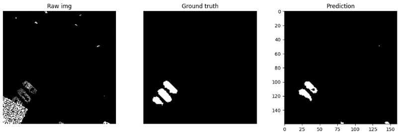

# About
🚧UNDER CONSTRUCTION🚧 <br>
This repository is part of the second episode of my newly started Computer Vision Code-Along blog post series. <br>

Until the this project and the related blog post is finished, have a seat and take a look at the previous episodes of the series on dev.to: <br>
[](https://dev.to/levente-slajcho/series/41278)

# Segment Vehicle LiDAR - U-Net Baseline

This project is a beginner-friendly computer vision pipeline for the Kaggle **Segment Vehicle LiDAR** competition. The goal is to detect vehicles in LiDAR-derived image tiles using semantic segmentation.

The dataset contains 160×160 images and COCO-style polygon annotations stored in a JSON file. The polygons are converted into binary masks, where vehicle pixels are labeled as `1` and background pixels as `0`.



## Project Structure

```text
segment-vehicle-lidar/
├── notebooks/
│   └── 01_exploration.ipynb
├── src/
│   ├── dataset.py
│   ├── model.py
│   └── train.py
├── checkpoint/
│   └── best_model.pth
└── README.md
```

## Current Features

* COCO-style JSON annotation loading
* Polygon-to-mask conversion using OpenCV
* PyTorch dataset and dataloader
* Minimal U-Net implementation
* Training loop with train/validation split
* BCEWithLogitsLoss baseline
* IoU validation metric
* Model checkpoint saving
* Notebook visualization of:

  * raw image
  * ground-truth mask
  * model prediction
  * prediction overlay

## Model

The current model is a small U-Net for binary semantic segmentation.

Input:

```text
3 × 160 × 160 image
```

Output:

```text
1 × 160 × 160 mask logits
```

The model uses encoder blocks, decoder blocks, transposed convolutions, and skip connections.

## Training

Run training with:

```bash
python src/train.py
```

The best model is saved to:

```text
checkpoint/best_model.pth
```

## Exploration

Use the notebook:

```text
notebooks/01_exploration.ipynb
```

to inspect images, masks, and model predictions.

## Notes

This is an initial baseline project. The current goal is to build a complete working segmentation pipeline before improving model quality.

Possible next improvements:

* BCE + Dice loss
* data augmentation
* learning rate scheduling
* better validation analysis
* Kaggle submission generation with RLE encoding

## License

This project is licensed under the MIT License.  
You are free to use, modify, and learn from the code with attribution.

Educational explanations, diagrams, and written materials may be reused with attribution.
